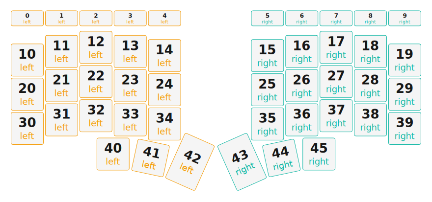

# ZMK Configuration for Cornish Hen

*Generated by Shield Wizard for ZMK*



Download compiled firmware from the Actions tab. <https://zmk.dev/docs/user-setup#installing-the-firmware>

Edit your keymap <https://zmk.dev/docs/keymaps>.
User keymap is located at [`config/cornish_hen.keymap`](config/cornish_hen.keymap).

-----

<details>
<summary>
Shield Wizard Debug Information
</summary>

In case of broken configuration, here is the Shield Wizard internal data used to generate this configuration:

Commit: 8a52249f61161469b6d90ed8c80c4aa52b9f3858

```json
{"name":"Cornish Hen","shield":"cornish_hen","dongle":false,"modules":[],"layout":[{"id":"01KJY1AZWB7YYSJ3H6ZA65SREC","part":0,"row":0,"col":0,"w":1,"h":0.5,"x":0,"y":-0.1,"r":0,"rx":0,"ry":0},{"id":"01KJY1DBGHW19664YXSE0F2ZS2","part":0,"row":0,"col":1,"w":1,"h":0.5,"x":1,"y":-0.1,"r":0,"rx":0,"ry":0},{"id":"01KJY1DCV16SJSDD0DJXXM1EPW","part":0,"row":0,"col":2,"w":1,"h":0.5,"x":2,"y":-0.1,"r":0,"rx":0,"ry":0},{"id":"01KJY1HGG8BVV9BECNKZ6PK9S1","part":0,"row":0,"col":3,"w":1,"h":0.5,"x":3,"y":-0.1,"r":0,"rx":0,"ry":0},{"id":"01KJY1HHA2FZWN1FR1N1NKD07A","part":0,"row":0,"col":4,"w":1,"h":0.5,"x":4,"y":-0.1,"r":0,"rx":0,"ry":0},{"id":"01KJY2K8YBGSNQF5MNGYZBSPTP","part":1,"row":0,"col":5,"w":1,"h":0.5,"x":7,"y":-0.1,"r":0,"rx":0,"ry":0},{"id":"01KJY2K9JCD1TKR7XY4J2VV896","part":1,"row":0,"col":6,"w":1,"h":0.5,"x":8,"y":-0.1,"r":0,"rx":0,"ry":0},{"id":"01KJY2K9WCJZEX3Q0JTC24BC3M","part":1,"row":0,"col":7,"w":1,"h":0.5,"x":9,"y":-0.1,"r":0,"rx":0,"ry":0},{"id":"01KJY2KADMH8TFFPXN4HZ3409M","part":1,"row":0,"col":8,"w":1,"h":0.5,"x":10,"y":-0.1,"r":0,"rx":0,"ry":0},{"id":"01KJY2KB9QH69B7SSG9T7WMPGH","part":1,"row":0,"col":9,"w":1,"h":0.5,"x":11,"y":-0.1,"r":0,"rx":0,"ry":0},{"id":"01KJY17CPCBRJ7JJ89M4PGHRH9","part":0,"row":1,"col":0,"w":1,"h":1,"x":0,"y":0.87,"r":0,"rx":0,"ry":0},{"id":"01KJY17CPCSYM1BVT6RVYYQ90J","part":0,"row":1,"col":1,"w":1,"h":1,"x":1,"y":0.62,"r":0,"rx":0,"ry":0},{"id":"01KJY17CPD3PWHSE9XVR1NNAZ6","part":0,"row":1,"col":2,"w":1,"h":1,"x":2,"y":0.5,"r":0,"rx":0,"ry":0},{"id":"01KJY17CPDMJVZQEBQ3GK6G8ZY","part":0,"row":1,"col":3,"w":1,"h":1,"x":3,"y":0.62,"r":0,"rx":0,"ry":0},{"id":"01KJY17CPDG6VNBWC88RS9ETS6","part":0,"row":1,"col":4,"w":1,"h":1,"x":4,"y":0.74,"r":0,"rx":0,"ry":0},{"id":"01KJY17CPDR7NEKA4KEEXVH27V","part":1,"row":1,"col":5,"w":1,"h":1,"x":7,"y":0.74,"r":0,"rx":0,"ry":0},{"id":"01KJY17CPDTCNC578ZFEJTTN32","part":1,"row":1,"col":6,"w":1,"h":1,"x":8,"y":0.62,"r":0,"rx":0,"ry":0},{"id":"01KJY17CPDXFRY2Y5F5ZRVWDZH","part":1,"row":1,"col":7,"w":1,"h":1,"x":9,"y":0.5,"r":0,"rx":0,"ry":0},{"id":"01KJY17CPDH0XJV5VTGVF26HP7","part":1,"row":1,"col":8,"w":1,"h":1,"x":10,"y":0.62,"r":0,"rx":0,"ry":0},{"id":"01KJY17CPD5RBFJPRQ2MW7TREP","part":1,"row":1,"col":9,"w":1,"h":1,"x":11,"y":0.87,"r":0,"rx":0,"ry":0},{"id":"01KJY17CPDXG1D6FE144TSYJ4X","part":0,"row":2,"col":0,"w":1,"h":1,"x":0,"y":1.87,"r":0,"rx":0,"ry":0},{"id":"01KJY17CPD0W3VPNR76BS1KT14","part":0,"row":2,"col":1,"w":1,"h":1,"x":1,"y":1.62,"r":0,"rx":0,"ry":0},{"id":"01KJY17CPDRER0WN9XE2JYY4AV","part":0,"row":2,"col":2,"w":1,"h":1,"x":2,"y":1.5,"r":0,"rx":0,"ry":0},{"id":"01KJY17CPDX8JY8SA09AZ0N419","part":0,"row":2,"col":3,"w":1,"h":1,"x":3,"y":1.62,"r":0,"rx":0,"ry":0},{"id":"01KJY17CPDK5GAX1CBTZGCF82H","part":0,"row":2,"col":4,"w":1,"h":1,"x":4,"y":1.74,"r":0,"rx":0,"ry":0},{"id":"01KJY17CPDQJ5YP58WYRS6JPN5","part":1,"row":2,"col":5,"w":1,"h":1,"x":7,"y":1.74,"r":0,"rx":0,"ry":0},{"id":"01KJY17CPDHXE0FRJR105ZT940","part":1,"row":2,"col":6,"w":1,"h":1,"x":8,"y":1.62,"r":0,"rx":0,"ry":0},{"id":"01KJY17CPDPSCN2Y2NXMBN3S3E","part":1,"row":2,"col":7,"w":1,"h":1,"x":9,"y":1.5,"r":0,"rx":0,"ry":0},{"id":"01KJY17CPDCP17G6MJQDGTEF9Z","part":1,"row":2,"col":8,"w":1,"h":1,"x":10,"y":1.62,"r":0,"rx":0,"ry":0},{"id":"01KJY17CPDMZ5KMBYCKRF4YHF1","part":1,"row":2,"col":9,"w":1,"h":1,"x":11,"y":1.87,"r":0,"rx":0,"ry":0},{"id":"01KJY17CPDB9NM6HT1PSRN9FY2","part":0,"row":3,"col":0,"w":1,"h":1,"x":0,"y":2.87,"r":0,"rx":0,"ry":0},{"id":"01KJY17CPDKRT07X4Y2Y06JBHV","part":0,"row":3,"col":1,"w":1,"h":1,"x":1,"y":2.62,"r":0,"rx":0,"ry":0},{"id":"01KJY17CPDN33TXYAVCK76ASAP","part":0,"row":3,"col":2,"w":1,"h":1,"x":2,"y":2.5,"r":0,"rx":0,"ry":0},{"id":"01KJY17CPDVWBVXEKZ8KC1STPB","part":0,"row":3,"col":3,"w":1,"h":1,"x":3,"y":2.62,"r":0,"rx":0,"ry":0},{"id":"01KJY17CPD3A38XZQNQFBYCJ5F","part":0,"row":3,"col":4,"w":1,"h":1,"x":4,"y":2.74,"r":0,"rx":0,"ry":0},{"id":"01KJY17CPD199QCDRHZ4DW40M6","part":1,"row":3,"col":5,"w":1,"h":1,"x":7,"y":2.74,"r":0,"rx":0,"ry":0},{"id":"01KJY17CPD47Q6GA8VZ4GJ4SFW","part":1,"row":3,"col":6,"w":1,"h":1,"x":8,"y":2.62,"r":0,"rx":0,"ry":0},{"id":"01KJY17CPDEXG2DT1Z8W8VGNJT","part":1,"row":3,"col":7,"w":1,"h":1,"x":9,"y":2.5,"r":0,"rx":0,"ry":0},{"id":"01KJY17CPDP9WD5P3ECGFCTJ7W","part":1,"row":3,"col":8,"w":1,"h":1,"x":10,"y":2.62,"r":0,"rx":0,"ry":0},{"id":"01KJY17CPDT3ZC7JB1QPMQH9X5","part":1,"row":3,"col":9,"w":1,"h":1,"x":11,"y":2.87,"r":0,"rx":0,"ry":0},{"id":"01KJY17CPEBPNPQT2V606NF7FD","part":0,"row":4,"col":2,"w":1,"h":1,"x":2.5,"y":3.62,"r":0,"rx":0,"ry":0},{"id":"01KJY17CPERQGV9RZEDEEK9TG8","part":0,"row":4,"col":3,"w":1,"h":1,"x":3.5,"y":3.62,"r":12,"rx":3.5,"ry":4.62},{"id":"01KJY17CPE4XEG8MV6BVR9MJ52","part":0,"row":4,"col":4,"w":1,"h":1.5,"x":4.48,"y":3.33,"r":24,"rx":4.48,"ry":4.83},{"id":"01KJY17CPEEJ1698S7QSN9YGY6","part":1,"row":4,"col":5,"w":1,"h":1.5,"x":6.52,"y":3.33,"r":-24,"rx":7.52,"ry":4.83},{"id":"01KJY17CPE4SMW103W4DEQVCPY","part":1,"row":4,"col":6,"w":1,"h":1,"x":7.5,"y":3.62,"r":-12,"rx":8.5,"ry":4.62},{"id":"01KJY17CPE2WYCG7Y0DXXWP773","part":1,"row":4,"col":7,"w":1,"h":1,"x":8.5,"y":3.62,"r":0,"rx":0,"ry":0}],"parts":[{"name":"left","controller":"nice_nano_v2","wiring":"matrix_diode","keys":{"01KJY1AZWB7YYSJ3H6ZA65SREC":{"input":"d2","output":"d16"},"01KJY1DBGHW19664YXSE0F2ZS2":{"input":"d2","output":"d10"},"01KJY1DCV16SJSDD0DJXXM1EPW":{"input":"d2","output":"d9"},"01KJY1HGG8BVV9BECNKZ6PK9S1":{"input":"d2","output":"d8"},"01KJY1HHA2FZWN1FR1N1NKD07A":{"input":"d2","output":"d7"},"01KJY17CPCBRJ7JJ89M4PGHRH9":{"input":"d3","output":"d16"},"01KJY17CPCSYM1BVT6RVYYQ90J":{"input":"d3","output":"d10"},"01KJY17CPD3PWHSE9XVR1NNAZ6":{"input":"d3","output":"d9"},"01KJY17CPDMJVZQEBQ3GK6G8ZY":{"input":"d3","output":"d8"},"01KJY17CPDG6VNBWC88RS9ETS6":{"input":"d3","output":"d7"},"01KJY17CPDXG1D6FE144TSYJ4X":{"input":"d4","output":"d16"},"01KJY17CPDRER0WN9XE2JYY4AV":{"input":"d4","output":"d9"},"01KJY17CPD0W3VPNR76BS1KT14":{"input":"d4","output":"d10"},"01KJY17CPDX8JY8SA09AZ0N419":{"input":"d4","output":"d8"},"01KJY17CPDK5GAX1CBTZGCF82H":{"input":"d4","output":"d7"},"01KJY17CPDB9NM6HT1PSRN9FY2":{"input":"d5","output":"d16"},"01KJY17CPDKRT07X4Y2Y06JBHV":{"input":"d5","output":"d10"},"01KJY17CPDN33TXYAVCK76ASAP":{"input":"d5","output":"d9"},"01KJY17CPDVWBVXEKZ8KC1STPB":{"input":"d5","output":"d8"},"01KJY17CPD3A38XZQNQFBYCJ5F":{"input":"d5","output":"d7"},"01KJY17CPEBPNPQT2V606NF7FD":{"input":"d6","output":"d9"},"01KJY17CPERQGV9RZEDEEK9TG8":{"input":"d6","output":"d8"},"01KJY17CPE4XEG8MV6BVR9MJ52":{"input":"d6","output":"d7"}},"encoders":[],"pins":{"d2":"input","d3":"input","d4":"input","d5":"input","d6":"input","d7":"output","d8":"output","d9":"output","d10":"output","d16":"output"},"buses":[{"type":"spi","name":"spi0","devices":[]},{"type":"spi","name":"spi1","devices":[]},{"type":"spi","name":"spi2","devices":[]},{"type":"spi","name":"spi3","devices":[]},{"type":"i2c","name":"i2c0","devices":[]},{"type":"i2c","name":"i2c1","devices":[]}]},{"name":"right","controller":"nice_nano_v2","wiring":"matrix_diode","keys":{"01KJY2KB9QH69B7SSG9T7WMPGH":{"input":"d2","output":"d16"},"01KJY2KADMH8TFFPXN4HZ3409M":{"input":"d2","output":"d10"},"01KJY2K9WCJZEX3Q0JTC24BC3M":{"input":"d2","output":"d9"},"01KJY2K9JCD1TKR7XY4J2VV896":{"input":"d2","output":"d8"},"01KJY2K8YBGSNQF5MNGYZBSPTP":{"input":"d2","output":"d7"},"01KJY17CPD5RBFJPRQ2MW7TREP":{"input":"d3","output":"d16"},"01KJY17CPDH0XJV5VTGVF26HP7":{"input":"d3","output":"d10"},"01KJY17CPDXFRY2Y5F5ZRVWDZH":{"input":"d3","output":"d9"},"01KJY17CPDTCNC578ZFEJTTN32":{"input":"d3","output":"d8"},"01KJY17CPDR7NEKA4KEEXVH27V":{"input":"d3","output":"d7"},"01KJY17CPDMZ5KMBYCKRF4YHF1":{"input":"d4","output":"d16"},"01KJY17CPDCP17G6MJQDGTEF9Z":{"input":"d4","output":"d10"},"01KJY17CPDPSCN2Y2NXMBN3S3E":{"input":"d4","output":"d9"},"01KJY17CPDHXE0FRJR105ZT940":{"input":"d4","output":"d8"},"01KJY17CPDQJ5YP58WYRS6JPN5":{"input":"d4","output":"d7"},"01KJY17CPDT3ZC7JB1QPMQH9X5":{"input":"d5","output":"d16"},"01KJY17CPDP9WD5P3ECGFCTJ7W":{"input":"d5","output":"d10"},"01KJY17CPDEXG2DT1Z8W8VGNJT":{"input":"d5","output":"d9"},"01KJY17CPD47Q6GA8VZ4GJ4SFW":{"input":"d5","output":"d8"},"01KJY17CPD199QCDRHZ4DW40M6":{"input":"d5","output":"d7"},"01KJY17CPE2WYCG7Y0DXXWP773":{"input":"d6","output":"d9"},"01KJY17CPE4SMW103W4DEQVCPY":{"input":"d6","output":"d8"},"01KJY17CPEEJ1698S7QSN9YGY6":{"input":"d6","output":"d7"}},"encoders":[],"pins":{"d2":"input","d3":"input","d4":"input","d5":"input","d6":"input","d7":"output","d8":"output","d9":"output","d10":"output","d16":"output"},"buses":[{"type":"spi","name":"spi0","devices":[]},{"type":"spi","name":"spi1","devices":[]},{"type":"spi","name":"spi2","devices":[]},{"type":"spi","name":"spi3","devices":[]},{"type":"i2c","name":"i2c0","devices":[]},{"type":"i2c","name":"i2c1","devices":[]}]}]}
```

</details>
